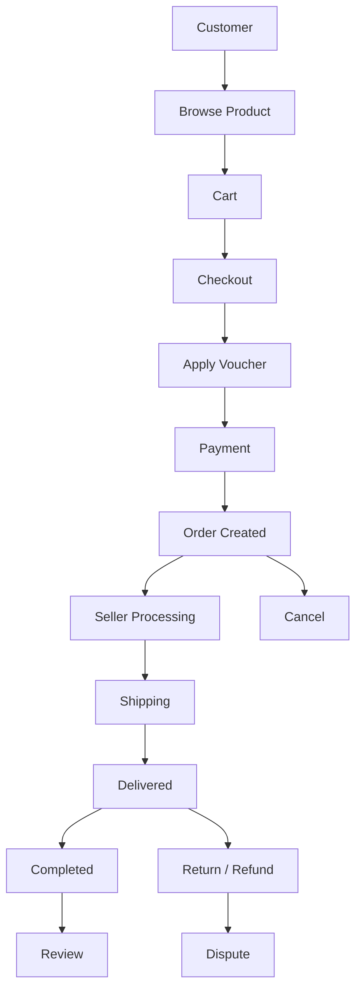
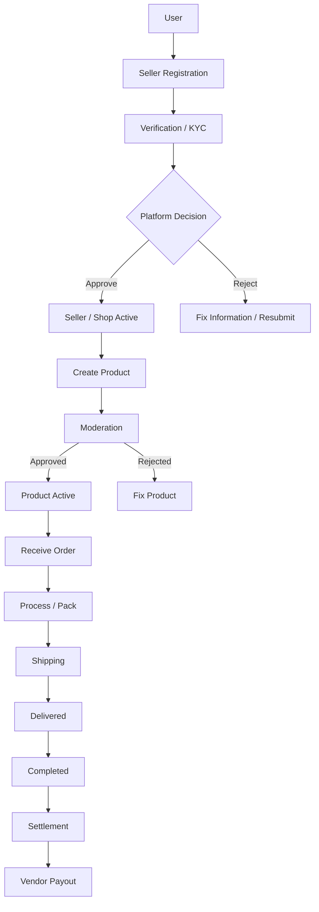
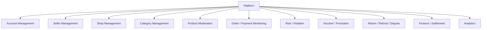
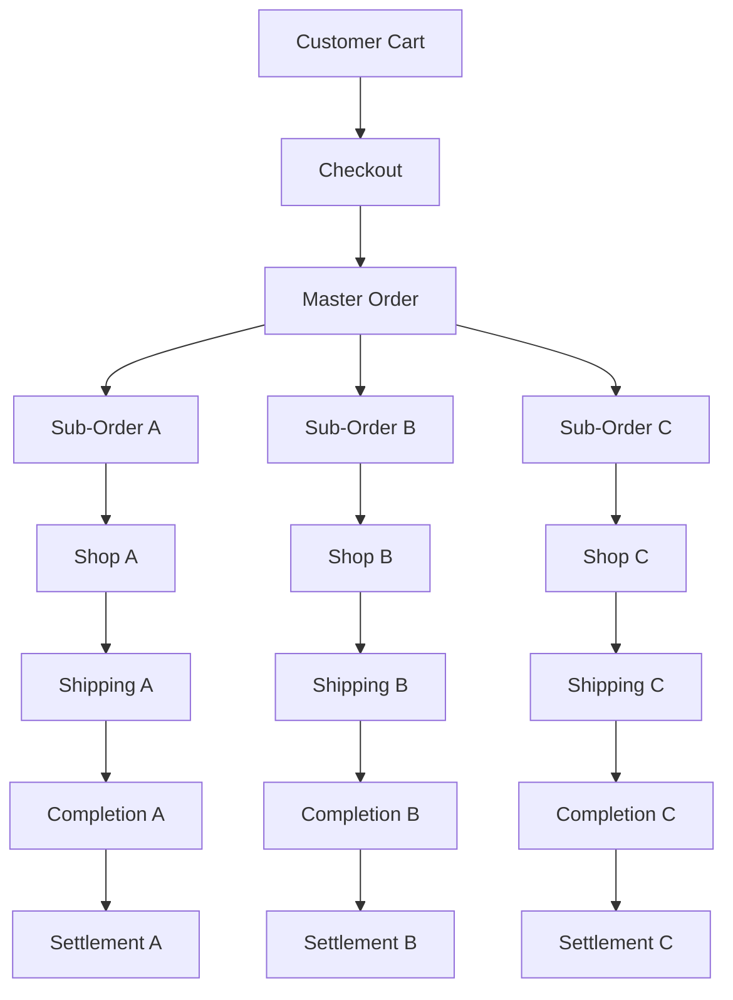
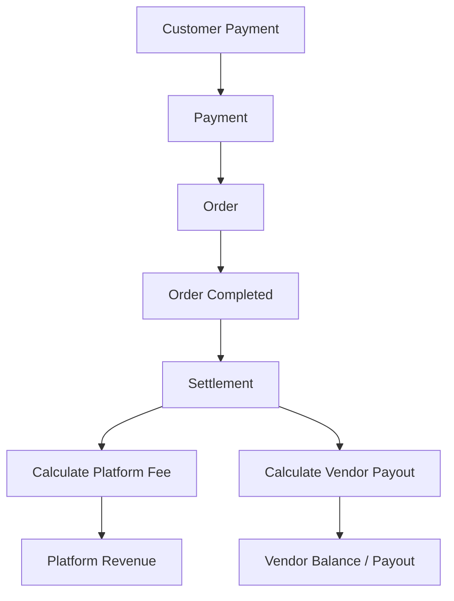

# SHOPEE_MARKETPLACE_MODEL.md

# PHASE: XÂY DỰNG MÔ HÌNH MARKETPLACE THEO HƯỚNG SHOPEE

> **Mục đích:** Chuẩn hóa mô hình nghiệp vụ Marketplace của project Ecommerce Java trước khi audit và sửa code.
>
> **Phạm vi:** Admin/Platform – Vendor/Seller – Customer/User, Shop, Product, Order, Payment, Shipping, Voucher/Promotion, Review, Return/Refund, Violation, Settlement/Payout.
>
> **Nguyên tắc:** Đây là mô hình tham chiếu theo cách vận hành Marketplace công khai của Shopee, không phải database schema nội bộ hay bản sao kiến trúc của Shopee. Những nội dung chưa thể xác minh phải được đánh dấu `[KHÔNG XÁC MINH ĐƯỢC]` hoặc `[BUSINESS DECISION]`.

---

## 0. MỤC TIÊU PHASE

Phase này có 2 mục tiêu:

1. Nghiên cứu và chuẩn hóa **Business Model Marketplace** trước khi động vào code.
2. Tạo một **baseline** để phase audit project Java có thể đối chiếu:

```text
SHOPEE MARKETPLACE MODEL
            ↓
BUSINESS RULE
            ↓
CONCEPTUAL ENTITY MODEL
            ↓
PERMISSION MODEL
            ↓
PROJECT AUDIT
            ↓
GAP LIST
            ↓
THỐNG NHẤT NHÓM
            ↓
MỚI ĐƯỢC SỬA CODE
```

### Không được làm trong Phase này

- Không tự ý sửa source code.
- Không tự ý tạo Entity mới trong project.
- Không tự ý đổi Role.
- Không thêm `SUPPLIER`.
- Không coi mô hình dưới đây là schema chính thức của Shopee.
- Không tự đặt Commission Rate nếu chưa có business decision.
- Không tự khẳng định một nghiệp vụ chưa có nguồn xác minh.

---

# 1. MÔ HÌNH MARKETPLACE

## 1.1. Marketplace là gì?

Shopee được hiểu theo mô hình **multi-vendor marketplace**: Platform cung cấp nền tảng để nhiều người bán/gian hàng kinh doanh với khách hàng.

Mô hình khái niệm:

```text
                    MARKETPLACE PLATFORM
                           │
              ┌────────────┼────────────┐
              │            │            │
              ↓            ↓            ↓
          CUSTOMER       SELLER       PLATFORM
                           │
                           ↓
                         SHOP
                           │
                           ↓
                        PRODUCT
                           │
                           ↓
                         ORDER
```

Platform không nên được mô hình hóa đơn giản như một Shop duy nhất bán toàn bộ sản phẩm.

### Phân biệt

```text
User
 ├── Customer
 └── Seller/Vendor

Seller
 └── Shop

Shop
 └── Product

Customer
 └── Order

Platform
 └── Quản lý và cung cấp hạ tầng Marketplace
```

> **Lưu ý:** Quan hệ chính xác như một Seller có thể sở hữu bao nhiêu Shop cần được xác nhận theo phạm vi project; không mặc định từ mô hình trên.

---

# 2. BA ACTOR CHÍNH

## 2.1. Platform / Admin

Trong project BTL, `ADMIN` nên được hiểu là **đại diện chức năng quản trị Platform**, không nhất thiết tương đương với một nhân viên duy nhất của Shopee.

Platform chịu trách nhiệm ở cấp hệ thống như:

- quản lý tài khoản;
- quản lý Seller;
- quản lý Shop;
- quản lý Category;
- kiểm duyệt sản phẩm/nội dung;
- xử lý vi phạm;
- quản lý Order ở góc độ Platform;
- quản lý Payment/Refund theo phạm vi hệ thống;
- Promotion/Voucher;
- Risk/Fraud;
- Customer Service/Dispute;
- Finance/Settlement;
- thống kê và vận hành.

### Nguyên tắc

```text
ADMIN
  ≠
SELLER

ADMIN
  ≠
OWNER OF EVERY SHOP

ADMIN
  =
PLATFORM OPERATOR
```

Admin không nên được thiết kế như người trực tiếp nhập/sửa toàn bộ dữ liệu kinh doanh của Seller.

---

## 2.2. Vendor / Seller

Seller là người bán kinh doanh trên Marketplace.

Seller chịu trách nhiệm:

- đăng ký bán hàng;
- cung cấp thông tin cần thiết;
- quản lý Shop;
- tạo/quản lý Product của Shop;
- quản lý tồn kho và giá;
- nhận và xử lý Order;
- chuẩn bị hàng;
- bàn giao vận chuyển;
- theo dõi doanh số;
- xử lý yêu cầu liên quan đến đơn hàng;
- nhận tiền Settlement/Payout theo quy định của Platform.

---

## 2.3. Customer

Customer là người mua hàng.

Customer có thể:

- đăng ký/đăng nhập;
- tìm kiếm sản phẩm;
- xem Shop/Product;
- thêm Cart;
- Checkout;
- áp dụng Voucher;
- thanh toán;
- theo dõi Order;
- nhận hàng;
- xác nhận/hoàn tất;
- Review;
- yêu cầu Cancel/Return/Refund;
- tham gia Dispute khi cần.

---

# 3. USER – SELLER – SHOP – PRODUCT

Đây là phần phải chuẩn hóa trước khi thiết kế Entity.

## 3.1. User

`User` là tài khoản hệ thống.

```text
User
 └── role
      ├── CUSTOMER
      ├── VENDOR
      └── ADMIN
```

Project giữ mô hình 3 Role:

```text
ROLE_ADMIN
ROLE_VENDOR
ROLE_CUSTOMER
```

**Không thêm `ROLE_SUPPLIER`.**

---

## 3.2. Seller / Vendor

Vendor là User có quyền kinh doanh trên Platform.

Không nên hiểu:

```text
User = Shop
```

Mà nên hiểu:

```text
User
 ↓
Seller capability
 ↓
Shop
```

---

## 3.3. Shop

Shop là gian hàng của Seller trên Platform.

Shop chứa thông tin kinh doanh như:

- tên Shop;
- logo;
- mô tả;
- địa chỉ lấy hàng;
- trạng thái;
- thông tin liên quan đến Seller;
- thông tin KYC nếu project cần quản lý.

### Trạng thái tham chiếu

```text
PENDING
   ↓
APPROVED
   ↓
ACTIVE
   ↓
SUSPENDED / LOCKED
```

> Các trạng thái cụ thể phải được chốt theo phạm vi project và nguồn nghiệp vụ được xác minh.

---

## 3.4. Product

Product thuộc phạm vi quản lý của Shop/Seller.

```text
Seller
   ↓
Shop
   ↓
Product
   ↓
Category
```

Product không thuộc trực tiếp về Customer.

---

# 4. SELLER ONBOARDING

Flow chuẩn hóa:

```text
User
 ↓
Đăng ký bán hàng
 ↓
Cung cấp thông tin cần thiết
 ↓
Verification / KYC
 ↓
Platform kiểm tra
 ├── APPROVED
 └── REJECTED
 ↓
Seller/Shop được phép hoạt động
```

## Các khái niệm phải tách biệt

```text
Account Verification
        ≠
Seller Verification / KYC
        ≠
Shop Approval
        ≠
Product Moderation
```

Không gộp tất cả thành một trường `approved=true`.

---

# 5. SELLER / SHOP VIOLATION

Mô hình nghiệp vụ tổng quát:

```text
Violation
    ↓
Warning / Penalty
    ↓
Restriction
    ↓
Suspension / Lock
```

Cần phân biệt:

```text
Seller Violation
        ≠
Product Violation
```

Ví dụ:

```text
Seller vi phạm
→ hạn chế quyền Seller/Shop

Product vi phạm
→ hạn chế/ẩn Product
```

### Không tự tạo

- số điểm phạt;
- số lần cảnh cáo;
- thời gian khóa;
- mức phạt tiền;

nếu chưa có nguồn hoặc business decision.

---

# 6. PRODUCT MODERATION

Flow tham chiếu:

```text
Vendor
 ↓
Create Product
 ↓
Submit
 ↓
Moderation
 ↓
ACTIVE / Published
```

Có thể sử dụng trạng thái conceptual:

```text
DRAFT
PENDING_APPROVAL
ACTIVE
REJECTED
HIDDEN
```

> Đây là mô hình đề xuất cho project, không được trình bày như danh sách status nội bộ chính thức của Shopee nếu chưa xác minh.

### Quy tắc quan trọng

Product bị ẩn/không còn bán:

```text
Product hiện tại
        ≠
xóa lịch sử Order
```

Dữ liệu Order cũ phải giữ được thông tin giao dịch cần thiết.

---

# 7. CATEGORY

Category là cấu trúc phân loại sản phẩm do Platform quản lý.

```text
Category
 ├── Electronics
 │    ├── Phone
 │    └── Laptop
 ├── Fashion
 └── Home
```

Seller chọn Category phù hợp khi tạo Product.

### Nguyên tắc

```text
Category
    ≠
Product
```

Seller không nên tự tạo Category Platform dùng chung nếu hệ thống không có chức năng đó.

---

# 8. CUSTOMER JOURNEY

Flow cơ bản:

```text
Register
 ↓
Login
 ↓
Browse
 ↓
Search
 ↓
View Product
 ↓
Add Cart
 ↓
Checkout
 ↓
Voucher
 ↓
Payment
 ↓
Order
 ↓
Seller Processing
 ↓
Shipping
 ↓
Delivered
 ↓
Completed
 ↓
Review
```

Nhánh ngoại lệ:

```text
Order
 ├── Cancel
 ├── Return
 ├── Refund
 └── Dispute
```

---

# 9. CART

Cart thuộc Customer.

```text
Customer
   ↓
Cart
   ├── Product A → Shop A
   ├── Product B → Shop B
   └── Product C → Shop C
```

Cart có thể chứa sản phẩm từ nhiều Shop.

Đây là điểm quan trọng phân biệt Marketplace nhiều Seller với Ecommerce một Seller.

---

# 10. ORDER MODEL

## 10.1. Order Item

Một Order cần giữ thông tin từng sản phẩm đã mua.

```text
Order
 └── OrderItem
       ├── Product
       ├── quantity
       ├── unit price
       └── subtotal
```

Không phụ thuộc hoàn toàn vào Product hiện tại để tái dựng lịch sử giao dịch.

---

## 10.2. Multi-Seller Checkout

Customer có thể mua:

```text
Product A → Seller A
Product B → Seller B
Product C → Seller C
```

Một lần Checkout có thể liên quan nhiều Seller.

Conceptual model:

```text
Customer
   ↓
Checkout
   ↓
Master Order
   ├── Sub-Order A → Seller A
   ├── Sub-Order B → Seller B
   └── Sub-Order C → Seller C
```

> Tên `Master Order` / `Sub-Order` là mô hình conceptual cho project, không khẳng định đây là tên Entity nội bộ của Shopee.

---

# 11. ORDER FLOW

```text
Customer
   ↓
Checkout
   ↓
Order Created
   ↓
Payment
   ↓
Seller Processing
   ↓
Packed
   ↓
Shipping
   ↓
Delivered
   ↓
Completed
```

Nhánh ngoại lệ:

```text
Pending
 ↓
Cancel

Delivered
 ↓
Return / Refund / Dispute
```

### Nguyên tắc

Seller xử lý phần Order thuộc Shop của mình.

```text
Seller A
   ↓
Sub-Order A

Seller B
   ↓
Sub-Order B
```

Seller không được mặc định có quyền quản lý Order của Seller khác.

---

# 12. PAYMENT

Phải tách các khái niệm:

```text
Customer Payment
        ≠
Vendor Sales
        ≠
Platform Revenue
        ≠
Platform Fee
        ≠
Vendor Payout
```

Mô hình:

```text
Customer
   ↓
Payment
   ↓
Platform / Payment Provider
   ↓
Order
   ↓
Settlement
   ├── Platform Fee
   └── Vendor Payout
```

### Escrow

Nếu project sử dụng mô hình ký quỹ:

```text
Customer Payment
       ↓
ESCROW / HOLD
       ↓
Order Completed
       ↓
Settlement
   ├── Platform Fee
   └── Vendor Payout
```

Không được khẳng định chi tiết tài khoản tiền hoặc cơ chế tài chính nội bộ của Shopee nếu chưa có nguồn công khai xác minh.

---

# 13. PLATFORM REVENUE

Công thức conceptual:

```text
Customer Payment
        ↓
Gross Transaction Value / GMV
        ↓
Platform Fee
        ↓
Platform Revenue
```

Ví dụ minh họa:

```text
Order = 10.000.000 VND
Commission = r%

Platform Fee = 10.000.000 × r%

Vendor Payout
= 10.000.000 - Platform Fee
```

**Không hard-code `r = 5%`**.

Nếu chưa chốt tỷ lệ:

```text
[BUSINESS DECISION]
Commission Rate = ?
```

### Dashboard Admin

Không gọi:

```text
Total Order Amount = Admin Revenue
```

Mà phải phân biệt:

```text
GMV
Platform Revenue
Vendor Sales
Vendor Payable
Escrow Balance
```

---

# 14. SETTLEMENT / PAYOUT

Settlement là lớp nghiệp vụ tài chính để ghi nhận kết quả phân chia tiền.

Conceptual:

```text
Sub-Order
   ↓
Settlement
   ├── Gross Amount
   ├── Platform Fee
   ├── Other applicable fees
   └── Vendor Payout
```

### Mục tiêu

Không để logic payout phụ thuộc vào Product hiện tại.

Settlement nên giữ được snapshot cần thiết của giao dịch tại thời điểm phát sinh.

---

# 15. VOUCHER / PROMOTION

Phải phân biệt:

```text
Platform Voucher
Seller Voucher
Promotion / Campaign
```

Conceptual:

```text
Platform Voucher
 └── Platform tài trợ

Seller Voucher
 └── Seller tài trợ
```

Các khoản giảm giá cần được phân bổ rõ khi tính:

```text
Customer Payable
Vendor Amount
Platform Cost
Settlement
```

Không tự giả định tỷ lệ Platform/Seller chịu chi phí nếu chưa có business rule.

---

# 16. SHIPPING

Flow:

```text
Seller
 ↓
Prepare Package
 ↓
Logistics
 ↓
Shipping
 ↓
Customer
 ↓
Delivered / Failed
```

Các khái niệm:

- Shipping;
- Tracking;
- Shipping Fee;
- Delivery;
- Failed Delivery;
- Return Shipping.

Nếu project chỉ mô phỏng Ecommerce thì có thể đơn giản hóa logistics, nhưng không được phá vỡ Order flow.

---

# 17. REVIEW

Flow:

```text
Customer
 ↓
Completed Order
 ↓
Review
 ↓
Product / Shop
```

Conceptual rule:

```text
Review
   ↓
phải liên quan đến giao dịch hợp lệ
```

Project nên tránh cho phép Customer review một Product chưa từng mua nếu business rule yêu cầu Verified Purchase.

Seller có thể có chức năng phản hồi Review nếu project phạm vi cho phép.

Platform có thể moderation nội dung vi phạm.

---

# 18. RETURN / REFUND / DISPUTE

Flow:

```text
Customer
 ↓
Return / Refund Request
 ↓
Seller
 ↓
Platform / Dispute
 ↓
Decision
 ↓
Refund / Return
```

Cần tách:

```text
Return
Refund
Dispute
```

### Return

Liên quan đến việc trả lại hàng.

### Refund

Liên quan đến việc hoàn tiền.

### Dispute

Liên quan đến tranh chấp giữa các bên.

Không gộp cả ba thành một trạng thái `REFUND`.

---

# 19. CUSTOMER DATA & PRIVACY

Phải phân biệt:

```text
Platform Data
        vs
Seller Operational Data
```

Seller cần dữ liệu Customer cần thiết để xử lý Order, nhưng không mặc định có quyền truy cập toàn bộ dữ liệu Customer của Platform.

Conceptual rule:

```text
Seller
 ↓
chỉ truy cập dữ liệu Customer cần thiết
cho nghiệp vụ Order/Shop của mình
```

Các quyền chi tiết về email/phone/address phải được xác minh theo chính sách thực tế và phạm vi project.

Nếu không xác minh:

```text
[KHÔNG XÁC MINH ĐƯỢC]
```

---

# 20. SELLER BỊ KHÓA

Flow:

```text
ACTIVE
 ↓
Violation
 ↓
SUSPENDED / LOCKED
```

Phải đánh giá riêng:

```text
Login
Shop
Product
New Order
Existing Order
Shipping
Return
Refund
Payout
```

Không được thiết kế một câu lệnh:

```text
delete Seller
```

và làm mất toàn bộ lịch sử giao dịch.

Nguyên tắc:

```text
Account/Shop bị hạn chế
        ≠
xóa lịch sử Order
```

---

# 21. PRODUCT BỊ KHÓA / VI PHẠM

Flow:

```text
ACTIVE PRODUCT
       ↓
Violation Detected
       ↓
Hidden / Restricted / Removed
```

Cần giữ:

```text
Product hiện tại
        ≠
Order History
```

Order cũ vẫn phải truy xuất được thông tin giao dịch cần thiết.

---

# 22. STATE MODEL CONCEPTUAL

## Seller / Shop

```text
PENDING
   ↓
APPROVED
   ↓
ACTIVE
   ↓
SUSPENDED / LOCKED
```

## Product

```text
DRAFT
   ↓
PENDING_APPROVAL
   ↓
ACTIVE
   ↓
HIDDEN / REJECTED
```

## Order

```text
CREATED
   ↓
PAID
   ↓
PROCESSING
   ↓
SHIPPING
   ↓
DELIVERED
   ↓
COMPLETED
```

Các nhánh:

```text
CREATED / PAID / PROCESSING
        ↓
      CANCEL

DELIVERED / COMPLETED
        ↓
   RETURN / REFUND
```

## Payment

```text
PENDING
   ↓
PAID / HOLD
   ↓
RELEASED
```

## Settlement

```text
PENDING
   ↓
CALCULATED
   ↓
SETTLED
```

> Đây là state model conceptual cho project, không phải danh sách trạng thái chính thức nội bộ của Shopee.

---

# 23. CONCEPTUAL ENTITY MODEL

Mô hình đề xuất:

```text
User
 ├── Customer
 ├── Vendor
 └── Admin

Vendor
 └── Shop
      ├── ShopKYC
      └── Product
             └── Category

Customer
 └── Cart
      └── CartItem

Customer
 └── Order
      ├── OrderItem
      ├── Payment
      ├── Shipping
      ├── ReturnRefundRequest
      └── Settlement

Product
 └── Review

Platform
 ├── Voucher
 ├── Promotion
 ├── Violation
 ├── Category
 └── Settlement
```

Quan hệ conceptual:

```text
Vendor 1 ── N Shop
Shop   1 ── N Product
Category 1 ── N Product
Customer 1 ── 1 Cart
Cart 1 ── N CartItem
Order 1 ── N OrderItem
Product 1 ── N Review
Order 1 ── N OrderItem
Order 1 ── N SubOrder
SubOrder N ── 1 Shop
SubOrder 1 ── 1 Settlement
```

> Cardinality phải được đối chiếu lại với scope project trước khi biến thành database schema.

---

# 24. PERMISSION MATRIX

Ký hiệu:

- `C`: Create
- `R`: Read
- `U`: Update
- `D`: Delete
- `M`: Moderate/Approve
- `-`: Không có quyền trực tiếp

| Nghiệp vụ        | Admin/Platform    | Vendor/Seller          | Customer                                  |
| ------------------ | ----------------- | ---------------------- | ----------------------------------------- |
| Account            | R/M               | R/U                    | C/R/U                                     |
| Seller             | R/M/U             | R/U                    | C                                         |
| Shop               | R/M/U             | C/R/U                  | R                                         |
| Product            | R/M/U             | C/R/U                  | R                                         |
| Category           | C/R/U/D           | R                      | R                                         |
| Cart               | R hỗ trợ        | -                      | C/R/U/D                                   |
| Order              | R/M               | R/U phần Shop mình   | C/R/U phần của mình                    |
| Payment            | R/M theo phạm vi | R                      | C/R                                       |
| Shipping           | R/M theo phạm vi | R/U xử lý Shop       | R                                         |
| Voucher            | C/R/U             | C/R/U Shop Voucher     | R/Apply                                   |
| Review             | R/M               | R/Reply theo phạm vi  | C/R                                       |
| Return             | R/M               | R/U xử lý phần Shop | C/R/U                                     |
| Refund             | R/M               | R/U theo quy trình    | C/R                                       |
| Violation          | C/R/U             | R/Appeal nếu có      | R/Report nếu có                         |
| Settlement         | R/M               | R                      | Không                                    |
| Platform Analytics | R                 | R dữ liệu Shop mình | R dữ liệu cá nhân/phần được phép |

> Matrix trên là **baseline thiết kế project**, không phải tuyên bố rằng giao diện Shopee thực tế có đúng từng quyền như vậy.

---

# 25. ADMIN DASHBOARD

Admin Dashboard phải phân biệt ít nhất:

## Operational KPIs

```text
Active Customers
Active/Pending Sellers
Active/Pending Products
Orders by Status
```

## Marketplace Financial KPIs

```text
GMV
Platform Revenue
Vendor Sales
Vendor Payable
Escrow/Held Amount
```

### Không được dùng

```text
Total Order Amount
        =
Admin Revenue
```

### Đúng về mặt khái niệm

```text
GMV
=
Tổng giá trị giao dịch

Platform Revenue
=
Khoản phí/thu nhập thuộc Platform

Vendor Sales
=
Doanh số thuộc Seller

Vendor Payout
=
Khoản Seller được nhận sau các khoản khấu trừ
```

---

# 26. END-TO-END CUSTOMER FLOW



---

# 27. END-TO-END SELLER FLOW



---

# 28. END-TO-END PLATFORM FLOW



---

# 29. MULTI-SELLER ORDER FLOW



---

# 30. PAYMENT – SETTLEMENT FLOW



---

# 31. CORE BUSINESS RULES

## BR-01 — 3 Role

Project sử dụng:

```text
ADMIN
VENDOR
CUSTOMER
```

Không thêm `SUPPLIER`.

---

## BR-02 — Seller quản lý Shop của mình

Vendor chỉ được quản lý Shop thuộc phạm vi của mình.

---

## BR-03 — Vendor quản lý Product của Shop

Vendor không được sửa Product của Shop khác.

---

## BR-04 — Platform quản lý Category

Category dùng chung thuộc Platform.

---

## BR-05 — Product Moderation

Nếu project yêu cầu moderation:

```text
Create Product
→ PENDING_APPROVAL
→ Admin Review
→ ACTIVE / REJECTED
```

---

## BR-06 — Multi-Seller Order

Customer có thể mua nhiều Shop trong một Checkout.

Project phải giữ được quan hệ:

```text
Order
→ Sub-Order
→ Shop
→ OrderItem
```

---

## BR-07 — Financial Separation

Không gộp:

```text
GMV
Vendor Sales
Platform Revenue
Vendor Payout
```

---

## BR-08 — Settlement

Settlement phải ghi nhận kết quả phân chia tiền của giao dịch.

---

## BR-09 — Review

Review phải gắn với Product/Order phù hợp với business rule.

---

## BR-10 — Historical Data

Không xóa lịch sử Order chỉ vì:

```text
Product hidden
Shop suspended
Seller locked
```

---

# 32. CÁC BUSINESS DECISION CẦN CHỐT

Các nội dung sau **không được tự quyết định trong code**:

### BD-01 — Commission

```text
Commission Rate = ?
```

- cố định;
- theo Category;
- theo Seller;
- hoặc cấu hình khác.

---

### BD-02 — Settlement Timing

```text
Vendor nhận tiền:
- khi Delivered?
- khi Customer xác nhận?
- sau N ngày?
```

---

### BD-03 — Product Moderation

```text
Admin duyệt từng Product?
hoặc
Auto-approve?
```

---

### BD-04 — Seller KYC

Project cần mức KYC nào?

```text
Basic
hay
Full Legal KYC
```

---

### BD-05 — Multi-Shop

Một Vendor:

```text
1 Shop
hay
N Shop?
```

---

### BD-06 — Voucher Funding

Khi có Platform Voucher:

```text
Platform chịu 100%?
Seller chia sẻ?
Có nhiều cơ chế?
```

---

### BD-07 — Return / Refund

Ai có quyền quyết định cuối cùng?

```text
Seller
hay
Platform
hay
phối hợp?
```

---

# 33. NGUYÊN TẮC DATA MODEL

Không thiết kế database chỉ dựa trên giao diện.

Phải đi theo:

```text
Business Concept
      ↓
Entity
      ↓
Relationship
      ↓
State
      ↓
Permission
      ↓
Service Logic
      ↓
Controller
      ↓
UI
```

### Đặc biệt

Không để:

```text
Dashboard
```

tự tính các chỉ số tài chính theo công thức tùy ý.

Financial calculation phải xuất phát từ business rule và dữ liệu giao dịch.

---

# 34. CHECKLIST TRƯỚC KHI AUDIT PROJECT

Audit project phải kiểm tra tối thiểu:

## Actor

- [ ] ADMIN
- [ ] VENDOR
- [ ] CUSTOMER

## Seller

- [ ] Seller registration
- [ ] Seller status
- [ ] Seller approval
- [ ] Seller rejection
- [ ] Seller restriction
- [ ] Seller violation

## Shop

- [ ] Shop ownership
- [ ] Shop status
- [ ] Shop profile
- [ ] Shop suspension

## Product

- [ ] Product ownership
- [ ] Category
- [ ] Product status
- [ ] Product moderation
- [ ] Product violation

## Customer

- [ ] Register/Login
- [ ] Browse
- [ ] Cart
- [ ] Checkout
- [ ] Order
- [ ] Review

## Order

- [ ] Order
- [ ] OrderItem
- [ ] Multi-Shop
- [ ] Sub-Order
- [ ] Seller-specific processing
- [ ] Cancel
- [ ] Delivery
- [ ] Completion

## Finance

- [ ] Payment
- [ ] Platform Fee
- [ ] Commission
- [ ] Settlement
- [ ] Vendor Payout
- [ ] Refund
- [ ] GMV
- [ ] Platform Revenue

## Platform

- [ ] Category Management
- [ ] Moderation
- [ ] Violation
- [ ] Voucher
- [ ] Promotion
- [ ] Dispute
- [ ] Dashboard

---

# 35. TIÊU CHUẨN KẾT THÚC PHASE

Phase này chỉ được coi là hoàn thành khi có đủ:

```text
[✓] Marketplace Business Model
[✓] 3 Actor Model
[✓] User/Seller/Shop/Product distinction
[✓] Seller Onboarding
[✓] Product Moderation
[✓] Category
[✓] Customer Flow
[✓] Cart
[✓] Multi-Seller Order
[✓] Payment
[✓] Platform Revenue
[✓] Voucher/Promotion
[✓] Shipping
[✓] Review
[✓] Return/Refund/Dispute
[✓] Seller Violation
[✓] Settlement/Payout
[✓] Customer Data boundary
[✓] State Model
[✓] Conceptual Entity Model
[✓] Permission Matrix
[✓] End-to-End Flow
[✓] Business Decision List
[✓] Audit Checklist
```

---

# 36. PHASE TIẾP THEO

Sau khi file này được nhóm thống nhất:

```text
PHASE 1
SHOPEE_MARKETPLACE_MODEL.md
        ↓
PHASE 2
AUDIT PROJECT
        ↓
PHASE 3
GAP ANALYSIS
        ↓
PHASE 4
DATA MODEL / ENTITY PLAN
        ↓
PHASE 5
BACKEND BUSINESS LOGIC
        ↓
PHASE 6
ADMIN / VENDOR / CUSTOMER UI
        ↓
PHASE 7
TEST
        ↓
PHASE 8
FINAL AUDIT
```

**Không bỏ qua Phase Audit.**

Không được nhìn mô hình này rồi sửa code ngay.

---

# 37. NGUYÊN TẮC QUAN TRỌNG NHẤT

Project không cần trở thành bản sao của Shopee.

Mục tiêu là:

```text
Shopee Marketplace
        ↓
Hiểu Business Model
        ↓
Chọn nghiệp vụ phù hợp BTL
        ↓
Thiết kế Marketplace nhất quán
        ↓
Giữ scope có thể triển khai
```

Do đó:

> **Shopee là mô hình tham chiếu nghiệp vụ, không phải yêu cầu phải clone toàn bộ Shopee.**

Mọi tính năng đưa vào project phải thỏa mãn:

```text
Có giá trị nghiệp vụ
        +
Phù hợp scope BTL
        +
Có thể triển khai
        +
Có thể demo
        +
Có thể kiểm thử
```

---

# 38. KẾT LUẬN MÔ HÌNH

Mô hình Marketplace cuối cùng:

```text
                         PLATFORM
                            │
          ┌─────────────────┼──────────────────┐
          │                 │                  │
          ↓                 ↓                  ↓
       CUSTOMER          SELLER             ADMIN
          │                 │                  │
          ↓                 ↓                  │
         CART              SHOP                │
          │                 │                  │
          │                 ↓                  │
          │              PRODUCT               │
          │                 │                  │
          └──────────────→ ORDER ←─────────────┘
                            │
                  ┌─────────┼─────────┐
                  ↓         ↓         ↓
               PAYMENT   SHIPPING   REVIEW
                  │
                  ↓
              COMPLETED
                  │
                  ↓
             SETTLEMENT
              ┌───┴───┐
              ↓       ↓
        PLATFORM FEE  VENDOR PAYOUT
```

Đây là **baseline để audit project Java hiện tại**.

Sau file này, nhiệm vụ tiếp theo không phải là sửa code ngay mà là:

```text
AUDIT TOÀN BỘ PROJECT
        ↓
SO SÁNH VỚI MODEL NÀY
        ↓
XÁC ĐỊNH:
- ĐÃ ĐÚNG
- ĐANG SAI
- ĐANG THIẾU
- ĐANG THỪA
- CẦN BUSINESS DECISION
        ↓
LẬP KẾ HOẠCH SỬA
```
